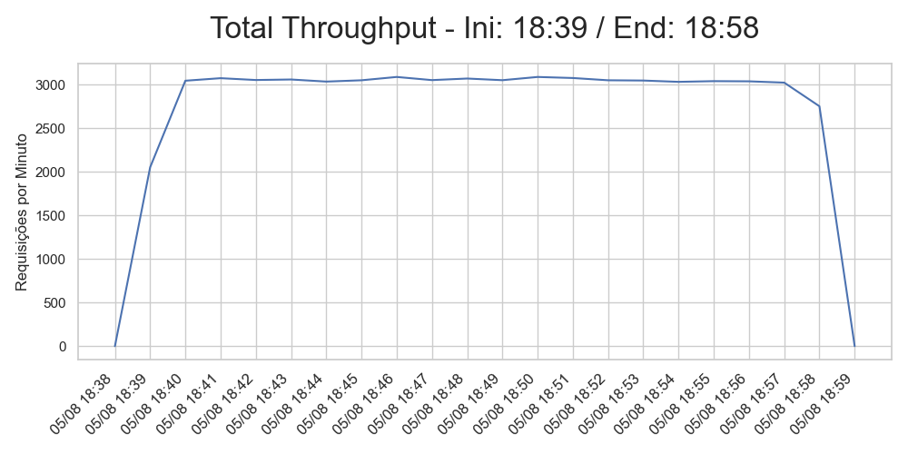
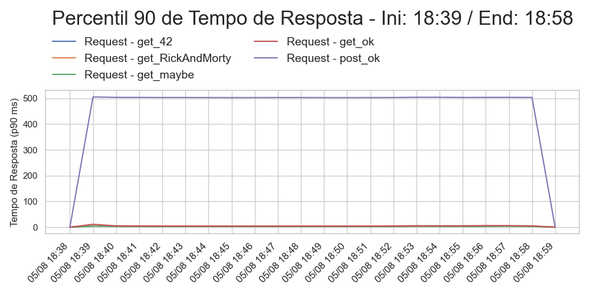
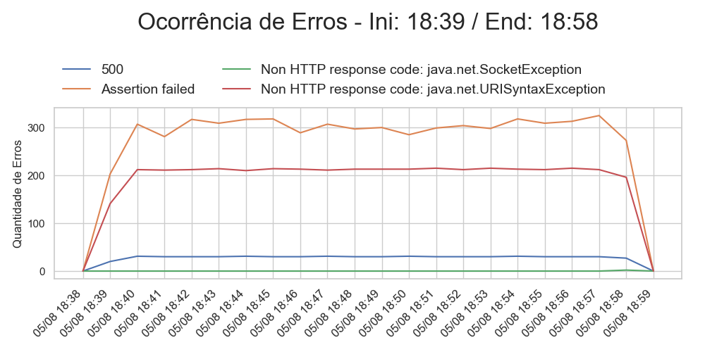

# Resultados do Teste de Carga - 12:18:23

## 1. Objetivo do Teste

O teste tem como objetivo estressar o ambiente XPTO para validar a capacidade de processar XXX requisições por segundo com uma performance dentro dos parâmetros de negócio aceitáveis.

## 2. Volumetria Mapeada

| Transação                     | Quantidade de Usuários  | Requisições por segundo  |
|-------------------------------|-------------------------|--------------------------|
| TC - 01 - Requisições Simples OK| XXX                     | XXXXX                    |
| TC - 02 - Asserções e interrupção do teste| XXX                     | XXXXX                    |
| TC - 03 - Grava Dados em Arquivo| XXX                     | XXXXX                    |

* Ambiente de teste X vezes menor que o ambiente de produção

## 3. Data de Execução

| Dados do Teste    |         |
|-------------------|---------|
| Data da Execução  | 05/08   |
| Inicio do Teste   | 18:39   |
| Fim do Teste      | 18:58   |

## 4. Participação

* Pessoa 1
* Pessoa 2
* Pessoa 3

## 5. Configuração das Baterias

| Bateria | Users / Threads | Rampup Time (segs) | Steps | Duração | ThinkTime (ms) |
|---------|-----------------|--------------------|-------|---------|----------------|
| 1       | 300             | 150                | 10    | 300     | 200            |
| 2       | 900             | 450                | 10    | 300     | 200            |
| 3       | 1800            | 600                | 20    | 600     | 500            |

## 6. Conclusão do Teste

### **6.1 Requisições Por Minuto**

A aplicação se manteve em uma média de cerca de 100 requisições por minuto alcançando picos de até 150 requisições.

### **6.2 Tempo de Resposta**

Observamos que o tempo de resposta geral em média se manteve em cerca de 0.5 segundos alcançando picos de até 2 segundos.

### **6.2 Erros**

Verificamos uma média de média 10 erros sendo o mais frequente o código de erro 500.

## 7. Pipelines

* Link Pipeline Executada: https://<URL_DO_ORQUESTRADOR>/_build/results?buildId=934108&view=results
